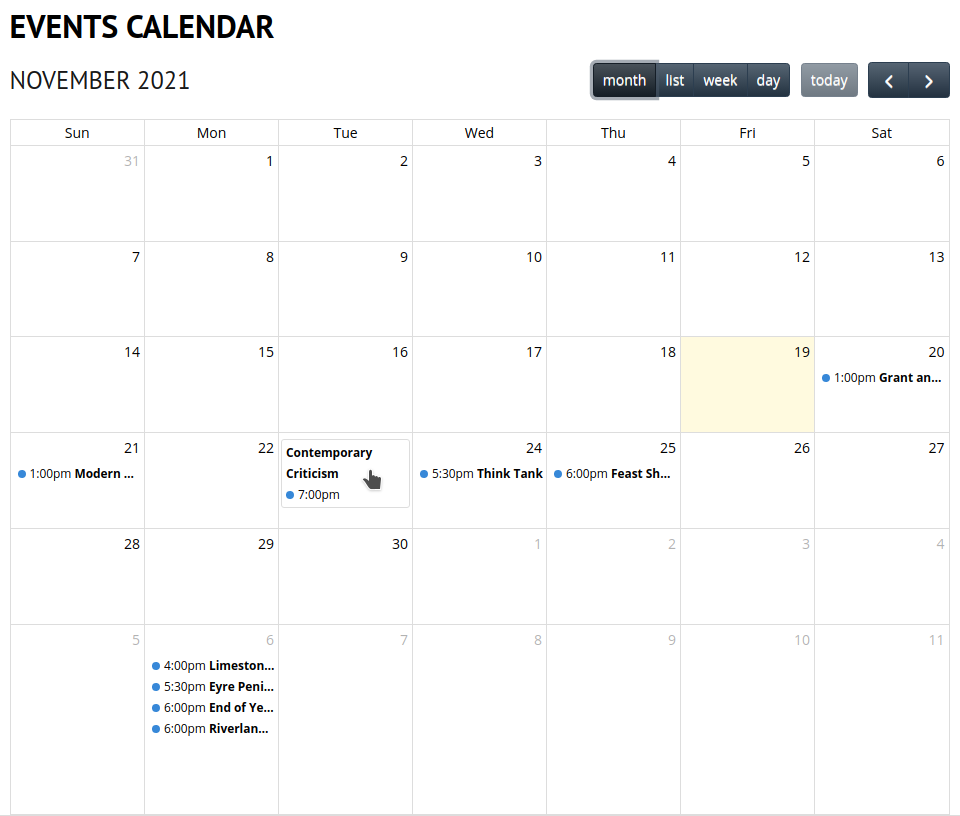

# CiviCRM UX User Guide

This plugin adds many useful shortcodes, some new Caldera Forms smart tags and provides additional functionality to improve the user experience for integrating CiviCRM with a WordPress site.

## Events Calendar Shortcode

Display a CiviCRM Events Calendar on your website using the [FullCalendar Javascript library](https://fullcalendar.io), see [https://fullcalendar.io](https://fullcalendar.io) for more details and [demonstrations](https://fullcalendar.io/demos) of the calendar options available.

Use WordPress shortcode `[ux_event_fullcalendar]` to display an interactive calendar of all CiviCRM Events which are both public and active.



## CiviCRM APIv4 Shortcode

The CiviCRM APIv4 is directly accessible using the `[ux_cv_api4_get]` WordPress shortcode. You can use the CiviCRM APIv4 Explorer to understand how to query CiviCRM using the APIv4.

Below are some examples of how the `[ux_cv_api4_get]` WordPress shortcode can be used.

### Event Listing Example 1

Example code to list single Event Type in ascending order.

The following example code can be inserted into a WordPress page when using the Code Editor mode. This code demonstrates:
* How to apply styles and layout to the listing.
* How to output an CiviCRM Custom Field for an Event. In this example, the field is Event_Extra.Event_Feature_Image which is used to record and display a featured image for the Event.

```
<!-- wp:shortcode -->
[ux_cv_api4_get entity=Event is_public=1 is_active=1 event_type_id=15 start_date=&gt;=:today sort=start_date:ASC]
<!-- /wp:shortcode -->

<!-- wp:heading {"level":3,"className":"ui-widget-header event-title"} -->
<h3 class="ui-widget-header event-title"><a href="https://example.org.au/event-registration/?id={{api4:id}}" target="_blank" rel="noreferrer noopener nofollow">[api4:title]</a></h3>
<!-- /wp:heading -->

<!-- wp:group {"className":"event-info-group"} -->
<div class="wp-block-group event-info-group"><!-- wp:columns -->
<div class="wp-block-columns"><!-- wp:column {"width":"33.33%"} -->
<div class="wp-block-column" style="flex-basis:33.33%"><!-- wp:paragraph {"align":"center"} -->
<p class="has-text-align-center">[api4:Event_Extra.Event_Feature_Image:img]</p>
<!-- /wp:paragraph -->

<!-- wp:paragraph -->
<p><strong>Date:</strong> [api4:start_date:%B %E, %Y]</p>
<!-- /wp:paragraph --></div>
<!-- /wp:column -->

<!-- wp:column {"width":"66.66%"} -->
<div class="wp-block-column" style="flex-basis:66.66%"><!-- wp:shortcode -->
[api4:summary]
<!-- /wp:shortcode --></div>
<!-- /wp:column --></div>
<!-- /wp:columns -->

<!-- wp:buttons {"contentJustification":"left"} -->
<div class="wp-block-buttons is-content-justification-left"><!-- wp:button {"className":"is-style-outline","fontSize":"normal"} -->
<div class="wp-block-button has-custom-font-size is-style-outline has-normal-font-size"><a class="wp-block-button__link" href="https://example.org.au/event-registration/?id={{api4:id}}" target="_blank" rel="noreferrer noopener">Register</a></div>
<!-- /wp:button --></div>
<!-- /wp:buttons --></div>
<!-- /wp:group -->

<!-- wp:shortcode -->
[/ux_cv_api4_get]
<!-- /wp:shortcode -->
```

### Event Listing Example 2

Example code to list multiple Event Types. Same as above, except changes the event_type_id parameter: `event_type_id=IN:18,19`

The following example code can be inserted into a WordPress page when using the Code Editor mode. This code demonstrates how to apply styles and layout to the listing.

```
<!-- wp:shortcode -->
[ux_cv_api4_get entity=Event is_public=1 is_active=1 event_type_id=IN:18,19 start_date=&gt;=:today sort=start_date:ASC]
<!-- /wp:shortcode -->

<!-- wp:heading {"level":3,"className":"ui-widget-header event-title"} -->
<h3 class="ui-widget-header event-title"><a href="https://example.org.au/event-registration/?id={{api4:id}}" target="_blank" rel="noreferrer noopener nofollow">[api4:title]</a></h3>
<!-- /wp:heading -->

<!-- wp:group {"className":"event-info-group"} -->
<div class="wp-block-group event-info-group"><!-- wp:columns -->
<div class="wp-block-columns"><!-- wp:column {"width":"33.33%"} -->
<div class="wp-block-column" style="flex-basis:33.33%"><!-- wp:paragraph {"align":"center"} -->
<p class="has-text-align-center">[api4:Event_Extra.Event_Feature_Image:img]</p>
<!-- /wp:paragraph -->

<!-- wp:paragraph -->
<p><strong>Date:</strong> [api4:start_date:%B %E, %Y]</p>
<!-- /wp:paragraph --></div>
<!-- /wp:column -->

<!-- wp:column {"width":"66.66%"} -->
<div class="wp-block-column" style="flex-basis:66.66%"><!-- wp:shortcode -->
[api4:summary]
<!-- /wp:shortcode --></div>
<!-- /wp:column --></div>
<!-- /wp:columns -->

<!-- wp:buttons {"contentJustification":"left"} -->
<div class="wp-block-buttons is-content-justification-left"><!-- wp:button {"className":"is-style-outline","fontSize":"normal"} -->
<div class="wp-block-button has-custom-font-size is-style-outline has-normal-font-size"><a class="wp-block-button__link" href="https://example.org.au/event-registration/?id={{api4:id}}" target="_blank" rel="noreferrer noopener">Register</a></div>
<!-- /wp:button --></div>
<!-- /wp:buttons --></div>
<!-- /wp:group -->

<!-- wp:shortcode -->
[/ux_cv_api4_get]
<!-- /wp:shortcode -->
```

### Event Information / Event Registration Page Example

Example code to display Event Information and the Event Registration form. This page will use the Event ID as passed in via the URL to load the related Event Information.

The Event in this example has CiviCRM Custom Fields as follows:
1. Event Feature Image
2. Presenter Heading
3. Presenter Information
4. Presenter Image

The standard CiviCRM Event Registration form is shown at the bottom of the page.

The following example code can be inserted into a WordPress page when using the Code Editor mode. This code demonstrates how to apply styles and layout to the listing.

```
<!-- wp:group {"className":"clearfix"} -->
<div class="wp-block-group clearfix"><!-- wp:shortcode -->
[ux_cv_api4_get entity=Event id=id]
<!-- /wp:shortcode -->

<!-- wp:shortcode -->
[api4:Event_Extra.Event_Feature_Image:img]
<!-- /wp:shortcode -->

<!-- wp:paragraph -->
<p>[api4:summary]</p>
<!-- /wp:paragraph -->

<!-- wp:shortcode -->
[api4:description]
<!-- /wp:shortcode -->

<!-- wp:heading {"level":3} -->
<h3>[api4:Presenter.Presenter_Heading]</h3>
<!-- /wp:heading -->

<!-- wp:group {"className":"alignright"} -->
<div class="wp-block-group alignright"><!-- wp:shortcode -->
[api4:Presenter.Presenter_Image:img]
<!-- /wp:shortcode --></div>
<!-- /wp:group -->

<!-- wp:shortcode -->
[api4:Presenter.Presenter_Information]
<!-- /wp:shortcode -->

<!-- wp:list {"className":"clear-float"} -->
<ul class="clear-float"><li><strong>Starts:</strong> [api4:start_date]</li><li><strong>Finishes:</strong> [api4:end_date]</li></ul>
<!-- /wp:list -->

<!-- wp:shortcode -->
[/ux_cv_api4_get]
<!-- /wp:shortcode --></div>
<!-- /wp:group -->

<!-- wp:heading {"level":3} -->
<h3>Registration Details</h3>
<!-- /wp:heading -->

<!-- wp:group {"className":"crm-hide-title"} -->
<div class="wp-block-group crm-hide-title"><!-- wp:shortcode -->
[civicrm component="event" action=register set_title=1]
<!-- /wp:shortcode --></div>
<!-- /wp:group -->
```

### Additional usage information

Specifying a non-numeric `id` attribute to the `[ux_cv_api4_get]` shortcode instructs it to use that value parameter in the GET request as the ID, e.g. `[ux_cv_api4_get entity=Event is_public=1 is_active=1 id=event_id]` with the url `http://example.org/event/?event_id=20` will result in the event with id 20 being fetched for the shortcode.

Implicit joins using Api4 are supported, e.g. `[api4:loc_block_id.address_id.street_address]`

Multi-value fields are output as a comma separated list where possible.

Limited format support is available:

* Date fields can have their format specified with the same format as [CiviCRM's date display](https://docs.civicrm.org/user/en/latest/initial-set-up/dates/), e.g. `[api4:start_date:%B %E, %Y]`
* File upload fields can be output as images with width, height, and alt text specified, e.g. `[api4:My_Custom_Field_Group.Image_Upload:img:800x300:alt=A picture]`
* A line break tag can be output with fields only when they contain data with `:br`, e.g. `[api4:My_Custom_Field_Group.Optional_Field:br]`
* Text fields may be truncated at a certain length using `[api4:title:100:chars:...]`, where the `chars` may be replaced by `words`. The `...` argument is optional, and will be added to the end of truncated strings.

### CiviCRM API trouble-shooting

If the CiviCRM API shortcode is not evaluating and returning a **blank** result, check the CiviCRM log file for errors. An error message along with a CiviCRM backtrace will be shown.

As the CiviCRM API requests are performed by the logged in user, verify that this user has the requisite permissions for the API request. This can be performed by executing the same command using the WP or CV CLI.

Using the **wp** CLI:
```wp --user=<WP User Name> cv api4 Contact.get +w id=<Contact ID>```

Using the **cv** CLI:
```cv --user=<WP User Name> api4 Contact.get +w id=<Contact ID>```

For Access Control, grant all users the CiviCRM permission: ```CiviCRM: access all custom data``` as this is required to view Custom Fields for Contacts. 

### CiviCRM API caching

CiviCRM API responses are cached as a WordPress transient with a minimum lifetime of 4 hours.

If the API request is returning the incorrect results or if you have changed the parameters and are not seeing the correct results, then try flushing the WordPress transient cache.

```wp transient delete --all```

## Campaign Shortcode

The Campaign shortcodes accept a CiviCRM Campaign ID as a parameter and display the fundraising goals by querying the CiviCRM Campaign and associated Contributions.
1. `[ux_campaign_info_thermometer id=3]`  
 The id of shortcode is the Campaign ID which you could find in **CiviCRM Dashboard >> Campaigns >> Campaign Dashboard**.  
 This shortcode consists of:
    * Funds raised to date;
    * Display thermometer style graph of funds and goal amount;
    * Campaign goal amount;
    * Campaign days remaining;
    * Total number of donations received;  
  This shortcode has been formatted in html with styling.
  
2. `[ux_campaign_honour_listing id=3 display-amount=false]`  
The id of shortcode is the Campaign ID which you could find in **CiviCRM Dashboard >> Campaigns >> Campaign Dashboard**.   
This shortcode is to display the honor roll information for CiviCRM Contributions related to the CiviCRM Campaign.   
The most recent 100 Contributions related to the Campaign will be displayed.   
The most recent contributor will be on the top of the list as well.   
Display-amount can be set as true or false. The default is false.  
This shortcode has been formatted in html with styling.

3. `[ux_campaign_thermometer id=1]`  
The id of shortcode is the Campaign ID which you could find in **CiviCRM Dashboard >> Campaigns >> Campaign Dashboard**.  
This shortcode without styling is to display the thermometer style graph of funds and goal amount.

4. `[ux_campaign_total_raised id=3]`  
The id of shortcode is the Campaign ID which you could find in **CiviCRM Dashboard >> Campaigns >> Campaign Dashboard**.  
This shortcode without styling is to display funds raised to date. For example, $ 525.00.

5. `[ux_campaign_goal_amount id=3]`  
The id of shortcode is the Campaign ID which you could find in **CiviCRM Dashboard >> Campaigns >> Campaign Dashboard**.  
This shortcode without styling is to display the goal amount of Campaign. For example, $ 2,000.00.

6. `[ux_campaign_end_date id=3]`  
The id of shortcode is the Campaign ID which you could find in **CiviCRM Dashboard >> Campaigns >> Campaign Dashboard**.  
This shortcode without styling is to display the end date of Campaign. For example, 31 June 2019.

7. `[ux_campaign_days_remaining id=3 end-text='on-going']`  
The id of shortcode is the Campaign ID which you could find in **CiviCRM Dashboard >> Campaigns >> Campaign Dashboard**.  
This shortcode without styling is to display days remaining of Campaign. For example, 3 days remaining.  
If the end date expires, it returns the text in 'end-text'. The text in 'end-text' can be changed to any text as well.

8. `[ux_campaign_number_contributions id=3]`   
The id of shortcode is the Campaign ID which you could find in **CiviCRM Dashboard >> Campaigns >> Campaign Dashboard**.  
This shortcode without styling is to display the total number of donations received. For example, 7.
 
**Note**:   
Id for the campaign id is required.  
Shortcodes return the raw string value except first 2 shortcodes.

## Event iCal Feed Shortcode

Event iCal Feed Shortcode `[ux_event_ical_feed]` generates a custom iCal Calendar and returns a URL to download the iCal file.

Shortcode accepts a CiviCRM Event type as a parameter and displays the event listings. For example: `[ux_event_ical_feed type="Meeting,Exhibition"]Click here to download an iCal feed of meeting and exhibitions[/ical-feed]`
 
The CiviCRM Event type parameter is optional. If the type is not specified, the iCal will include all Event types.

## Event Listing Shortcode

This shortcode will display upcoming CiviCRM events which have a start date of today or a future date. `[ux_event_listing days=5 type="Training"]`  

The type of shortcode is the Event Type which you could find in **CiviCRM Dashboard >> CiviEvent >> Event Types**.   
The event listing displays the start date, the end date, the event name, the registration link, the brief description of event and the link for more information.
The 'days' parameter is optional. This can be used to limit the upcoming events to only those with a event start date in the next 'days'.
The 'type' is optional. If the type is not specified, there will be an event listing of all types of events.
This shortcode has been formatted in html with styling.
 
## Membership Shortcodes

1. `[ux_membership_expiry]`  
Return a HTML tag with the membership expiry date of the login user.

1. `[ux_membership_id]`  
Return the membership id of the login user.

1. `[ux_membership_join_url]`
Return the join form URL. The URL can be configured in the settings page.

1. `[ux_membership_renewal_date]`  
Return the renewal date of the membership for the login user

1. `[ux_membership_renewal_url]`  
Return the renewal form URL. The URL can be configured in the settings page.

1. `[ux_membership_status]`  
Return the membership status of the login user.

1. `[ux_membership_summary]`  
Return the membership summary of the login user.

1. `[ux_membership_type]`  
Return the membership type of the login user.

## CiviCRM Data List using the CiviCRM Data Processor Shortcode

`[ux_civicrm_listing]`
 - **dpid**: data processor id
 - **limit**: the limit of result default is 0(no limit)
 - **sort**: the order of result
 - **autopop_user_id**: get the logged in user id and pass it to the parameter. State the parameter name, like *contact_id*
 - **format**: default is table
 
This shortcode requires the [CiviCRM Data Processor](https://lab.civicrm.org/extensions/dataprocessor) extension to be installed on the CiviCRM site.

## Activity Shortcode

`[ux_activity_listing]`  
Parameters:
 - `$type`: activity type id or activity type label. Support multiple values separated by a comma without space. The default is empty.
 - `$limit`: the maximum number for the activity result. The default is 0 (unlimited).
 - `$relationship-id`: the activities of contacts which have relationships will be added into the result.
 - `$field`: the fields to return. Separated by a comma without space. The default returns contact names and activity subjects. 
 The order of the output fields will follow the order of the input fields.
 - `$format`: the display format. For example, `table` for a tabular layout
 - `$sort`: sorting field names in ascending or descending order with `ASC` or `DESC`. The default is `activity_date_time DESC`.
 
For example:  
`[ux_activity_listing type='Test' relationship-id=5 field='status,source_contact_name,activity_date_time']`

## Contact Shortcode

`[ux_contact_value]`
Parameters:
 - `id`             the contact id. Default is the current login user
 - `permission`     what permissions to check. Separated by comma. Default is 'View All Contacts'
 - `id_from_url`    if given any name, the shortcode will get contact id from url with the given name
 - `field`          what field to display **required**
 - `default`        the value to display if empty

## Caldera magic tags

Provides additional Caldera magic tags when using both [Caldera Forms](https://wordpress.org/plugins/caldera-forms/) and [Caldera Forms CiviCRM](https://wordpress.org/plugins/cf-civicrm/) plugins to integrate CiviCRM with WordPress.

1. `{contact:related_subtype}`  
Return the sub-type of the related contact.  
This magic tag is designed for a specific website (the relationship type is hardcoded). You can change the code if you know what you are doing.

1. `{contact:subtype}`  
Return all sub-types of the login user.

1. `{member:membership}`  
Return all memberships of the login user.

1. `{member:membership_type}`  
Return the membership type of the login user. Also work with checksum.

1. `{member:membership_value}`  
Return the price field value id of the login user's membership.

1. `{member:renewal}`  
Return 0 if there is no membership for the login user; 1 if the membership of the login user is going to expire in three months.

1. `{user:roles}`  
Return the user roles of the logged in user, each role is comma separated

# For Developers

## REST API

@TODO Documentation in this section is incomplete

## iCal feed
- ICalFeed/event
- ICalFeed/manage

### Parameters
`type`: filter for event type  
For example, https://example.com/wp-json/ICalFeed/manage?hash=some&type=Meeting,Exhibition

- Using this feed with Google calendar may get issue with its [long refresh period](https://webapps.stackexchange.com/a/6315).

## WordPress helper shortcodes

@TODO Documentation in this section is incomplete

`[ux_cf_value]`
- `type`
- `id`
- `field`
- `single`
- `default` not used yet.

This shortcode is designed for developers. The first four attributes will be passed to [`get_metadata`](https://developer.wordpress.org/reference/functions/get_metadata/).

`[ux_convert_date]`
- `return_timezone` the 'to' timezone
- `timezone` the 'from' timezone

The date format for both input and output is `d/m/Y g:ia`

## How to add shortcode
1. Create a php file in **shortcodes** directory.
2. Within the file, create a class which implements `iCivicrm_Ux_Shortcode`.
3. Implement all functions defined in the interface. It is recommended to use PhpStorm.

## How to add REST API route
1. Create a php file in **rest** directory.
2. Within the file, create a class which implement `iCivicrm_Ux_REST`.
3. Implement all functions defined in the interface. It is recommended to use PhpStorm.

## CSS and JavaScript
All css files should be in `public/css` or `admin/css`. If the new css files are created, please make sure to enqueue them.
All javascript files should be in `public/js` or `admin/js`.

# About the Authors

This WordPress plugin was developed by the team at [Agileware](https://agileware.com.au).

[Agileware](https://agileware.com.au) provide a range of CiviCRM services including:

* CiviCRM migration
* CiviCRM integration
* CiviCRM extension development
* CiviCRM support
* CiviCRM hosting
* CiviCRM remote training services

Support your Australian [CiviCRM](https://civicrm.org) developers, [contact Agileware](https://agileware.com.au/contact) today!


