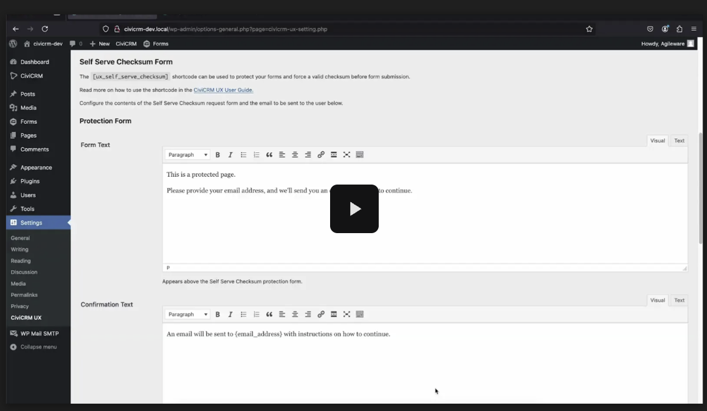

# CiviCRM UX User Guide

This plugin adds many useful shortcodes, some new Caldera Forms smart tags and provides additional functionality to improve the user experience for integrating CiviCRM with a WordPress site.

## Events Calendar Shortcode

Display a CiviCRM Events Calendar on your website using the [FullCalendar Javascript library](https://fullcalendar.io), see [https://fullcalendar.io](https://fullcalendar.io) for more details and [demonstrations](https://fullcalendar.io/demos) of the calendar options available.

Use WordPress shortcode `[ux_event_fullcalendar]` to display an interactive calendar of all CiviCRM Events which are both public and active.


### Shortcode options

You can include additional parameters in the fullcalendar shortcode to limit the scope of events shown on the calendar or to add extra visual features (colors, images) that are not included out of the box. None of these additional parameters are strictly required.
- *`types`* is a comma-separated list of Event Types (using Event Type Label) that can be used to filter Events by Event Type; e.g. `[ux_event_fullcalendar types="Workshop,Meeting,Exhibition"]` will show only events that are workshops, meetings or exhibitions. By default, FullCalendar will show all event types on your system.
- *`colors`* is a comma-separated list of hex rgb codes that can be used to apply a background colour to each Event Type, *without* the leading `#` character in the codes; e.g. `[ux_event_fullcalendar types="Workshop,Meeting,Exhibition" colors="52246d,c45472,ce8d8b"]` will apply the colours `#52246d`, `#c45472` and `#ce8d8b` to the Workshop, Meeting and Exhibition type events respectively. These will not be applied unless the `types` parameter is also include.
- *`start`* is the date from which active events will be displayed. For example, `[ux_event_fullcalendar start="2021-01-01"]` will show only events from the 1st of January 2021 onwards. If this parameter is not specified, the calendar will show events starting from 1 year prior to the current date.
- *`force_login`* - true or false; when true, the calendar forces anonymous users to log in before registering for an event.
- *`redirect_after_login`* - optionally provide a URL to redirect to after login. Useful if you have a custom Event registration page, instead of the default CiviCRM event registration page.
- *`img_src_field`*: the field name the path to the event image. This must be a custom text field for CiviCRM events, containing a path relative to the WordPress uploads directory, 

### Removed parameters

1. REMOVED: `image_id_field`.  
   Nonfunctional parameter to use a CiviCRM custom file field as the event image.
2. REMOVED: `upload`
   Override to image upload location. Generally only useful in combination with `image_id_field` on CiviCRM installations with unusual data directories. 

## CiviCRM APIv4 Shortcode

The CiviCRM APIv4 is directly accessible using the `[ux_cv_api4_get]` WordPress shortcode. You can use the CiviCRM APIv4 Explorer to understand how to query CiviCRM using the APIv4.

Below are some examples of how the `[ux_cv_api4_get]` WordPress shortcode can be used.

### Event Listing Example 1

Example code to list single Event Type in ascending order.

The following example code can be inserted into a WordPress page when using the Code Editor mode. This code demonstrates:
* How to apply styles and layout to the listing.
* How to output an CiviCRM Custom Field for an Event. In this example, the field is Event_Extra.Event_Feature_Image which is used to record and display a featured image for the Event.

```
<!-- wp:shortcode -->
[ux_cv_api4_get entity=Event is_public=1 is_active=1 event_type_id=15 start_date=&gt;=:today sort=start_date:ASC]
<!-- /wp:shortcode -->

<!-- wp:heading {"level":3,"className":"ui-widget-header event-title"} -->
<h3 class="ui-widget-header event-title"><a href="https://example.org.au/event-registration/?id={{api4:id}}" target="_blank" rel="noreferrer noopener nofollow">[api4:title]</a></h3>
<!-- /wp:heading -->

<!-- wp:group {"className":"event-info-group"} -->
<div class="wp-block-group event-info-group"><!-- wp:columns -->
<div class="wp-block-columns"><!-- wp:column {"width":"33.33%"} -->
<div class="wp-block-column" style="flex-basis:33.33%"><!-- wp:paragraph {"align":"center"} -->
<p class="has-text-align-center">[api4:Event_Extra.Event_Feature_Image:img]</p>
<!-- /wp:paragraph -->

<!-- wp:paragraph -->
<p><strong>Date:</strong> [api4:start_date:%B %E, %Y]</p>
<!-- /wp:paragraph --></div>
<!-- /wp:column -->

<!-- wp:column {"width":"66.66%"} -->
<div class="wp-block-column" style="flex-basis:66.66%"><!-- wp:shortcode -->
[api4:summary]
<!-- /wp:shortcode --></div>
<!-- /wp:column --></div>
<!-- /wp:columns -->

<!-- wp:buttons {"contentJustification":"left"} -->
<div class="wp-block-buttons is-content-justification-left"><!-- wp:button {"className":"is-style-outline","fontSize":"normal"} -->
<div class="wp-block-button has-custom-font-size is-style-outline has-normal-font-size"><a class="wp-block-button__link" href="https://example.org.au/event-registration/?id={{api4:id}}" target="_blank" rel="noreferrer noopener">Register</a></div>
<!-- /wp:button --></div>
<!-- /wp:buttons --></div>
<!-- /wp:group -->

<!-- wp:shortcode -->
[/ux_cv_api4_get]
<!-- /wp:shortcode -->
```

### Event Listing Example 2

Example code to list multiple Event Types. Same as above, except changes the event_type_id parameter: `event_type_id=IN:18,19`

The following example code can be inserted into a WordPress page when using the Code Editor mode. This code demonstrates how to apply styles and layout to the listing.

```
<!-- wp:shortcode -->
[ux_cv_api4_get entity=Event is_public=1 is_active=1 event_type_id=IN:18,19 start_date=&gt;=:today sort=start_date:ASC]
<!-- /wp:shortcode -->

<!-- wp:heading {"level":3,"className":"ui-widget-header event-title"} -->
<h3 class="ui-widget-header event-title"><a href="https://example.org.au/event-registration/?id={{api4:id}}" target="_blank" rel="noreferrer noopener nofollow">[api4:title]</a></h3>
<!-- /wp:heading -->

<!-- wp:group {"className":"event-info-group"} -->
<div class="wp-block-group event-info-group"><!-- wp:columns -->
<div class="wp-block-columns"><!-- wp:column {"width":"33.33%"} -->
<div class="wp-block-column" style="flex-basis:33.33%"><!-- wp:paragraph {"align":"center"} -->
<p class="has-text-align-center">[api4:Event_Extra.Event_Feature_Image:img]</p>
<!-- /wp:paragraph -->

<!-- wp:paragraph -->
<p><strong>Date:</strong> [api4:start_date:%B %E, %Y]</p>
<!-- /wp:paragraph --></div>
<!-- /wp:column -->

<!-- wp:column {"width":"66.66%"} -->
<div class="wp-block-column" style="flex-basis:66.66%"><!-- wp:shortcode -->
[api4:summary]
<!-- /wp:shortcode --></div>
<!-- /wp:column --></div>
<!-- /wp:columns -->

<!-- wp:buttons {"contentJustification":"left"} -->
<div class="wp-block-buttons is-content-justification-left"><!-- wp:button {"className":"is-style-outline","fontSize":"normal"} -->
<div class="wp-block-button has-custom-font-size is-style-outline has-normal-font-size"><a class="wp-block-button__link" href="https://example.org.au/event-registration/?id={{api4:id}}" target="_blank" rel="noreferrer noopener">Register</a></div>
<!-- /wp:button --></div>
<!-- /wp:buttons --></div>
<!-- /wp:group -->

<!-- wp:shortcode -->
[/ux_cv_api4_get]
<!-- /wp:shortcode -->
```

### Event Information / Event Registration Page Example

Example code to display Event Information and the Event Registration form. This page will use the Event ID as passed in via the URL to load the related Event Information.

The Event in this example has CiviCRM Custom Fields as follows:
1. Event Feature Image
2. Presenter Heading
3. Presenter Information
4. Presenter Image

The standard CiviCRM Event Registration form is shown at the bottom of the page.

The following example code can be inserted into a WordPress page when using the Code Editor mode. This code demonstrates how to apply styles and layout to the listing.

```
<!-- wp:group {"className":"clearfix"} -->
<div class="wp-block-group clearfix"><!-- wp:shortcode -->
[ux_cv_api4_get entity=Event id=id]
<!-- /wp:shortcode -->

<!-- wp:shortcode -->
[api4:Event_Extra.Event_Feature_Image:img]
<!-- /wp:shortcode -->

<!-- wp:paragraph -->
<p>[api4:summary]</p>
<!-- /wp:paragraph -->

<!-- wp:shortcode -->
[api4:description]
<!-- /wp:shortcode -->

<!-- wp:heading {"level":3} -->
<h3>[api4:Presenter.Presenter_Heading]</h3>
<!-- /wp:heading -->

<!-- wp:group {"className":"alignright"} -->
<div class="wp-block-group alignright"><!-- wp:shortcode -->
[api4:Presenter.Presenter_Image:img]
<!-- /wp:shortcode --></div>
<!-- /wp:group -->

<!-- wp:shortcode -->
[api4:Presenter.Presenter_Information]
<!-- /wp:shortcode -->

<!-- wp:list {"className":"clear-float"} -->
<ul class="clear-float"><li><strong>Starts:</strong> [api4:start_date]</li><li><strong>Finishes:</strong> [api4:end_date]</li></ul>
<!-- /wp:list -->

<!-- wp:shortcode -->
[/ux_cv_api4_get]
<!-- /wp:shortcode --></div>
<!-- /wp:group -->

<!-- wp:heading {"level":3} -->
<h3>Registration Details</h3>
<!-- /wp:heading -->

<!-- wp:group {"className":"crm-hide-title"} -->
<div class="wp-block-group crm-hide-title"><!-- wp:shortcode -->
[civicrm component="event" action=register set_title=1]
<!-- /wp:shortcode --></div>
<!-- /wp:group -->
```

### Additional usage information

Implicit joins using Api4 are supported, e.g. `[api4:loc_block_id.address_id.street_address]`

Multi-value fields are output as a comma separated list where possible.

Limited format support is available:

* Date fields can have their format specified with the same format as [CiviCRM's date display](https://docs.civicrm.org/user/en/latest/initial-set-up/dates/), e.g. `[api4:start_date:%B %E, %Y]`
* File upload fields can be output as images with width, height, and alt text specified, e.g. `[api4:My_Custom_Field_Group.Image_Upload:img:800x300:alt=A picture]`
* A line break tag can be output with fields only when they contain data with `:br`, e.g. `[api4:My_Custom_Field_Group.Optional_Field:br]`

#### Filtering

Specifying a non-numeric `id` attribute to the `[ux_cv_api4_get]` shortcode instructs it to use that value parameter in the GET request as the ID, e.g. `[ux_cv_api4_get entity=Event is_public=1 is_active=1 id=event_id]` with the url `http://example.org/event/?event_id=20` will result in the event with id 20 being fetched for the shortcode.

You can define custom filters through the GET request query parameters by adding `?<parameter>` to the shortcode attribute value. For example:

`[ux_cv_api4_get entity=Event cache_results=false my_events=true participant_status_id=IN:1,2,7,8,14,15,17?participant_status_id is_public=1 is_active=1 sort=start_date:DESC?sort limit=0]`

- If the `participant_status_id` query parameter is not present, the shortcode attribute will default to the value before the `?`.
- If the `participant_status_id` query parameter is present, the shortcode attribute value will be replaced by the query parameter value.

For now, a form can be built using a Custom HTML WordPress block. Use the HTML ID `wp-civicrm-ux-filter-form` on the form element to enable JavaScript handling from `wp-civicrm-ux-filter.js`.

At this stage, only select lists are supported for filters.

- Map the name of the select element to the desired query parameter.
- Set the option values to the value to pass through to the shortcode attribute.

Example usage:
```
<form id="wp-civicrm-ux-filter-form">
   <label for"participant_status_id">Filter events</label>
   <select name="participant_status_id">
      <option value="">All Events</option>
      <option value="1">Upcoming / Mark Attendance</option>
      <option value="17">Incomplete Evaluations</option>
   </select>
   <label for"sort">Sort by</label>
   <select name="sort">
      <option value="start_date:DESC">Date Descending</option>
      <option value="start_date:ASC">Date Ascending</option>
   </select>
</form>
```


### CiviCRM API trouble-shooting

If the CiviCRM API shortcode is not evaluating and returning a **blank** result, check the CiviCRM log file for errors. An error message along with a CiviCRM backtrace will be shown.

As the CiviCRM API requests are performed by the logged in user, verify that this user has the requisite permissions for the API request. This can be performed by executing the same command using the WP or CV CLI.

Using the **wp** CLI:
```wp --user=<WP User Name> cv api4 Contact.get +w id=<Contact ID>```

Using the **cv** CLI:
```cv --user=<WP User Name> api4 Contact.get +w id=<Contact ID>```

For Access Control, grant all users the CiviCRM permission: ```CiviCRM: access all custom data``` as this is required to view Custom Fields for Contacts. 

### CiviCRM API caching

CiviCRM API responses are cached as a WordPress transient with a minimum lifetime of 4 hours. With the exception when the page URL includes the ?reset parameter, these requests are not cached at all. This is particularly useful for Events and Contribution pages, so that the latest changes are always shown.

If the API request is returning the incorrect results or if you have changed the parameters and are not seeing the correct results, then try flushing the WordPress transient cache.

```wp transient delete --all```

Alternatively, add the optional shortcode parameter *`cache_results=false`* to bypass caching. This is useful if you do not want to add the ?reset parameter to the URL. For example, `[ux_cv_api4_get entity=Event cache_results=false id=id]`.

## Campaign Shortcode

The Campaign shortcodes accept a CiviCRM Campaign ID as a parameter and display the fundraising goals by querying the CiviCRM Campaign and associated Contributions.
1. `[ux_campaign_info_thermometer id=3]`  
 The id of shortcode is the Campaign ID which you could find in **CiviCRM Dashboard >> Campaigns >> Campaign Dashboard**.  
 This shortcode consists of:
    * Funds raised to date;
    * Display thermometer style graph of funds and goal amount;
    * Campaign goal amount;
    * Campaign days remaining;
    * Total number of donations received;  
  This shortcode has been formatted in html with styling.
  
2. `[ux_campaign_honour_listing id=3 display-amount=false]`  
The id of shortcode is the Campaign ID which you could find in **CiviCRM Dashboard >> Campaigns >> Campaign Dashboard**.   
This shortcode is to display the honor roll information for CiviCRM Contributions related to the CiviCRM Campaign.   
The most recent 100 Contributions related to the Campaign will be displayed.   
The most recent contributor will be on the top of the list as well.   
Display-amount can be set as true or false. The default is false.  
This shortcode has been formatted in html with styling.

3. `[ux_campaign_thermometer id=1]`  
The id of shortcode is the Campaign ID which you could find in **CiviCRM Dashboard >> Campaigns >> Campaign Dashboard**.  
This shortcode without styling is to display the thermometer style graph of funds and goal amount.

4. `[ux_campaign_total_raised id=3]`  
The id of shortcode is the Campaign ID which you could find in **CiviCRM Dashboard >> Campaigns >> Campaign Dashboard**.  
This shortcode without styling is to display funds raised to date. For example, $ 525.00.

5. `[ux_campaign_goal_amount id=3]`  
The id of shortcode is the Campaign ID which you could find in **CiviCRM Dashboard >> Campaigns >> Campaign Dashboard**.  
This shortcode without styling is to display the goal amount of Campaign. For example, $ 2,000.00.

6. `[ux_campaign_end_date id=3]`  
The id of shortcode is the Campaign ID which you could find in **CiviCRM Dashboard >> Campaigns >> Campaign Dashboard**.  
This shortcode without styling is to display the end date of Campaign. For example, 31 June 2019.

7. `[ux_campaign_days_remaining id=3 end-text='on-going']`  
The id of shortcode is the Campaign ID which you could find in **CiviCRM Dashboard >> Campaigns >> Campaign Dashboard**.  
This shortcode without styling is to display days remaining of Campaign. For example, 3 days remaining.  
If the end date expires, it returns the text in 'end-text'. The text in 'end-text' can be changed to any text as well.

8. `[ux_campaign_number_contributions id=3]`   
The id of shortcode is the Campaign ID which you could find in **CiviCRM Dashboard >> Campaigns >> Campaign Dashboard**.  
This shortcode without styling is to display the total number of donations received. For example, 7.
 
**Note**:   
Id for the campaign id is required.  
Shortcodes return the raw string value except first 2 shortcodes.

## Event iCal Feed Shortcode

Event iCal Feed Shortcode `[ux_event_ical_feed]` generates a custom iCal Calendar and returns a URL to download the iCal file.

- *`type`* optional parameter to filter Events by Event Type (using Event Type Label). For example: `[ux_event_ical_feed type="Meeting,Exhibition"]Click here to download an iCal feed of meeting and exhibitions[/ical-feed]`. If `type` is not specified, then will include all Event Types.

## Event Listing Shortcode

This shortcode will display upcoming CiviCRM events which have a start date of today or a future date. `[ux_event_listing days=5 type="Training"]`  
The event listing displays the start date, the end date, the event name, the registration link, the brief description of event and the link for more information. This shortcode has been formatted in html with styling.
- *`type`* optional parameter to filter Events by Event Type (using Event Type Label). If `type` is not specified, then will include all Event Types.
- *`days`* optional parameter to limit the upcoming events to only those with a event start date in the X number of days.

## Event Cancel Registration Shortcodes

These shortcodes will enable users to cancel their registration for an event. It requires a FormProcessor to handle the participant status update. This comes with the advantage of customisation for the FormProcessor, so you can do things like handle associated Contributions, trigger an email to be sent, and generate Activities.

The following shortcodes *must* be used together:

- *`[ux_event_cancelregistration]`* provides a WordPress nonce for authentication
- *`[ux_event_cancelregistration_button text="My Button Text" eventid={{api4:id}}]`* outputs a button with the given text for the given event id. It also outputs a confirmation modal dialog for the given event id. You could provide the id, for example, via `[ux_cv_api4_get]` as shown here, which is perfect for generated listings, or hardcode it in for specific event pages. It will not render for events the current logged in user does not have an active registration for.

You will also need to enable the Form Processor CiviCRM extension, and create a `cancel_event_registration` form processor. It is recommended to import the one provided in the data directory of this extension as a starting point.

## Event Mark Attendance Shortcodes

These shortcodes provide a way to optionally allow users to mark their own attendance for an event. It uses a FormProcessor to handle the participant status update.

The following shortcodes *must* be used together:

- *`[ux_event_markattendance]`* provides a WordPress nonce for authentication
- *`[ux_event_markattendance_button text="My Button Text" eventid={{api4:id}} attended_status={{status_id}} not_attended_status={{status_id}}]`* outputs a button with the given text for the given event id. It also outputs a confirmation modal dialog for the given event id. You could provide the id, for example, via `[ux_cv_api4_get]` as shown here, which is perfect for generated listings, or hardcode it in for specific event pages. You can customise which status (by ID) to set when the user has selected they have attended using `attended_status`, and which to set when they have not attended using `not_attended_status`. The button will not render for events the current logged in user does not have an active registration for, and has not passed.

You will also need to enable the Form Processor CiviCRM extension, and create a `mark_event_attendance` form processor. It is recommended to import the one provided in the data directory of this extension as a starting point.

## Custom Button Shortcode

`[ux_custom_button]` Outputs a button to a given link. Can be used to add a button that is shown conditionally, as long as the link is available, or if a fallback exists. This can be useful for directing users to a specific page, e.g. a survey form for a particular event, or a fallback page if one doesn't exist. This is useful in listings, or on specific event pages.

Example usage:

`[ux_custom_button text="Complete Evaluation" url={{api4:Evaluation_survey.Evaluation_link}} fallback_url="/event-evaluation-survey/" url_params="?pid={{api4:participant.id}}&eid={{api4:id}}&event_title={{api4:title}}" css_classes="my-class"]`

- *`text`* Defines the button text.
- *`url`* The target URL. You can populate this dynamically, for example by using `[ux_cv_api4_get]`.
- *`fallback_url`* Optional. A fallback in case the URL is null. This can also be populated dynamically.
- *`url_params`* Optionally declare parameters as a string to append to either the URL or the Fallback URL.
- *`css_classes`* Optionally include additional css classes.


### Troubleshooting

- Ensure the REST API link tag from `rest_output_link_wp_head()` is correctly generated. If you cannot find it in the page source code, it may be being stripped by another plugin.
- After canceling a registration from a listing created using `[ux_cv_api4_get]`, the page will reload. If the changes are not reflected in your event listing, the results of the API call may have been cached. See the section on *CiviCRM API caching* above for advice.

 
## Membership Shortcodes

1. `[ux_membership]`
Outputs a table for memberships information. Designed to wrap around `[ux_membership_row]` shortcodes to build a summary of memberships data for a given user. Override the shortcode-membership template part in your theme to customise.

1. `[ux_membership_row]`
Outputs a table row of membership data. Checks for the logged in contact's cid, or cid and checksum in the URL parameters. If multiple memberships are found for the contact based on the filters provided, each membership will output a row. Override the shortcode-membership-row template part in your theme to customise. Uses the following parameters:
- *`membership_type`* Optional: A comma separated list of membership type IDs to filter by.
- *`membership_status`* Optional: A comma separated list of membership status names to filter by.
- *`expiration_offset`* Optional: A relative date format string to filter membership end_date by. For example, if set to "30 days", will filter memberships by those whose `end_date` is before today + 30 days.
- *`renewal_url`* Optional: A URL to a page the user should be directed to in order to process their membership renewal. This URL will have the contact's cid, maybe their checksum if they are not logged in, and the membership id appended to it. This allows you to define separate membership renewal forms based on the other filter criteria above.

```
[ux_membership_row membership_type="1,5" membership_status="Current,Grace,Expired" expiration_offset="30 days" renewal_url="/civicrm/contribute/transact/?reset=1&id=1"]
```

### Renewing a membership inherited by relationship

When linking to a CiviCRM Contribution Page to renew a membership inherited by relationship, it is important to be aware that the contact must have a permissioned relationship with the related contact. This enables the contact to renew the membership on behalf of the primary member, typically an organisation. If there is no permissioned relationship then a new organisation will be entered and the unsupervised duplicate matching rules for organisations will be used. A new membership instead of a membership renewal may also be created. [See the CiviCRM documentation for more details](https://docs.civicrm.org/user/en/latest/membership/defining-memberships)

### Deprecated
*The following shortcodes are marked for deprecation in a future release in favour of the above shortcodes.*

1. DEPRECATED: `[ux_membership_expiry]`  
   Return a HTML tag with the membership expiry date of the login user.
2. DEPRECATED: `[ux_membership_id]`  
   Return the membership id of the login user.
3. DEPRECATED: `[ux_membership_join_url]`  
   Return the join form URL. The URL can be configured in the settings page.
4. DEPRECATED: `[ux_membership_renewal_date]`  
   Return the renewal date of the membership for the login user
5. DEPRECATED: `[ux_membership_renewal_url]`  
   Return the renewal form URL. The URL can be configured in the settings page.
6. DEPRECATED: `[ux_membership_status]`  
   Return the membership status of the login user.
7. DEPRECATED: `[ux_membership_summary]`  
   Return the membership summary of the login user.
8. DEPRECATED: `[ux_membership_type]`  
   Return the membership type of the login user. 

## CiviCRM Data Processor Shortcode

This shortcode will output a [CiviCRM Data Processor](https://lab.civicrm.org/extensions/dataprocessor), in a table format. The Data Processor being used must have a API output defined and for this API output, the  API Entity must also be set.

`[ux_civicrm_listing]`
 - **dpid**: Data Processor ID
 - **limit**: the limit of result default is 0 (no limit)
 - **sort**: the order of result, either: asc (ascending) or desc (descending)
 - **autopop_user_id**: return the logged-in user ID and passas a parameter to the Data Processor. Define the parameter name, like *contact_id*
 - **hide_fields**: comma separated list of fields to be excluded from the output.
 - **css_id**: CSS ID to assign to the table.

The example usage below uses a Data Processor with the ID of 4, excludes the contact_id column from display and assigns the CSS ID of member_directory to the table.

[Datatables](https://datatables.net/) can be used to add features to the table displayed on the page, as shown below. 

```
[ux_civicrm_listing dpid=4 autopop_user_id=0 hide_fields=contact_id css_id=member_directory format=datatable][/ux_civicrm_listing]

<script type="text/javascript" src="//cdn.datatables.net/1.13.1/js/jquery.dataTables.min.js" id="datatable-js-js"></script>

<script type="text/javascript">
        jQuery(document).ready(function () {
            jQuery('#member_directory').DataTable({
                'paging': true,
                'pageLength': 50,
                order: [[0, 'asc']],
                columns: [
                    { title: 'Member Name' },
                    { title: 'Country' },
                ],
            });
        });
</script>
```


## Activity Shortcode

`[ux_activity_listing]`  
Parameters:
 - `$type`: activity type id or activity type label. Support multiple values separated by a comma without space. The default is empty.
 - `$limit`: the maximum number for the activity result. The default is 0 (unlimited).
 - `$relationship-id`: the activities of contacts which have relationships will be added into the result.
 - `$field`: the fields to return. Separated by a comma without space. The default returns contact names and activity subjects. 
 The order of the output fields will follow the order of the input fields.
 - `$format`: the display format. For example, `table` for a tabular layout
 - `$sort`: sorting field names in ascending or descending order with `ASC` or `DESC`. The default is `activity_date_time DESC`.
 
For example:  
`[ux_activity_listing type='Test' relationship-id=5 field='status,source_contact_name,activity_date_time']`

## Contact Shortcode

`[ux_contact_value]`
Parameters:
 - `id`             the contact id. Default is the current login user
 - `permission`     what permissions to check. Separated by comma. Default is 'View All Contacts'
 - `id_from_url`    if given any name, the shortcode will get contact id from url with the given name
 - `field`          what field to display **required**
 - `default`        the value to display if empty

For example: to display the External ID of a Contact, use this shortcode
`[ux_contact_value field="external_identifier"]`

## Self Serve Checksum Form

Watch the video below which demonstrates how to use the Self Serve Checksum Form.

[](https://drive.google.com/file/d/1FZk2okVlxxqDQg178vOorxbEVDGMLVVD/view?usp=drive_link)

### Shortcode
`[ux_self_serve_checksum]`
Protect your CiviCRM integrated forms by forcing users to access them with a valid checksum URL.
Read more about [CiviCRM Checksum Tokens here](https://docs.civicrm.org/user/en/latest/common-workflows/tokens-and-mail-merge/#checksum).

Wrap the content and form you wish to protect in the shortcode. When the page is accessed without a valid checksum in the URL, the Self Serve Checksum Protection Form will be displayed. After providing their email address, an email will be sent to them with a link back to the page containing a valid checksum. The form will then be accessible for them to complete.

```
<!-- wp:shortcode -->
[ux_self_serve_checksum]
<!-- /wp:shortcode -->

<!-- wp:gravityforms/form {"formId":"1","title":false,"inputPrimaryColor":"#204ce5"} /-->

<!-- wp:shortcode -->
[/ux_self_serve_checksum]
<!-- /wp:shortcode -->

<!-- wp:paragraph -->
<p></p>
<!-- /wp:paragraph -->
```

### Settings and Customisation
Comes with settings in the CiviCRM UX settings page to quickly change:
  - the content of the Self Serve Checksum protection form text
  - the content of the confirmation message shown when the email submitted has a valid Contact record in CiviCRM
  - the content of the invalid contact message shown when the email submitted is not in CiviCRM
  - the email message sent to the user with the link to view the form

Also comes with the following filter hooks:
  - *`ux_self_serve_checksum_email_subject`* - Changes the subject line for the email sent to user.

```
// Hook to modify the subject line of the Self Serve Checksum email
add_filter('ux_self_serve_checksum_email_subject', function($subject, $pageTitle) {
    $subject = $pageTitle . This is a custom subject line modified by filters';
    return $subject;
}, 10, 2);
```

### Cloudflare Turnstile
You can protect your Self Serve Checksum Form against spam using the free service [Cloudflare Turnstile](https://www.cloudflare.com/en-gb/products/turnstile/). Once you have a sitekey and secret key, simply add them to the settings.

# For Developers

## REST API

@TODO Documentation in this section is incomplete

## iCal feed
- ICalFeed/event
- ICalFeed/manage

### Parameters
`type`: filter for event type  
For example, https://example.com/wp-json/ICalFeed/manage?hash=some&type=Meeting,Exhibition

- Using this feed with Google calendar may get issue with its [long refresh period](https://webapps.stackexchange.com/a/6315).

## WordPress helper shortcodes

@TODO Documentation in this section is incomplete

`[ux_cf_value]`
- `type`
- `id`
- `field`
- `single`
- `default` not used yet.

This shortcode is designed for developers. The first four attributes will be passed to [`get_metadata`](https://developer.wordpress.org/reference/functions/get_metadata/).

`[ux_convert_date]`
- `return_timezone` the 'to' timezone
- `timezone` the 'from' timezone

The date format for both input and output is `d/m/Y g:ia`

## How to add shortcode
1. Create a php file in **shortcodes** directory.
2. Within the file, create a class which implements `iCivicrm_Ux_Shortcode`.
3. Implement all functions defined in the interface. It is recommended to use PhpStorm.

## How to add REST API route
1. Create a php file in **rest** directory.
2. Within the file, create a class which implement `iCivicrm_Ux_REST`.
3. Implement all functions defined in the interface. It is recommended to use PhpStorm.

## CSS and JavaScript
All css files should be in `public/css` or `admin/css`. If the new css files are created, please make sure to enqueue them.
All javascript files should be in `public/js` or `admin/js`.

# About the Authors

This WordPress plugin was developed by the team at [Agileware](https://agileware.com.au).

[Agileware](https://agileware.com.au) provide a range of CiviCRM services including:

* CiviCRM migration
* CiviCRM integration
* CiviCRM extension development
* CiviCRM support
* CiviCRM hosting
* CiviCRM remote training services

Support your Australian [CiviCRM](https://civicrm.org) developers, [contact Agileware](https://agileware.com.au/contact) today!


